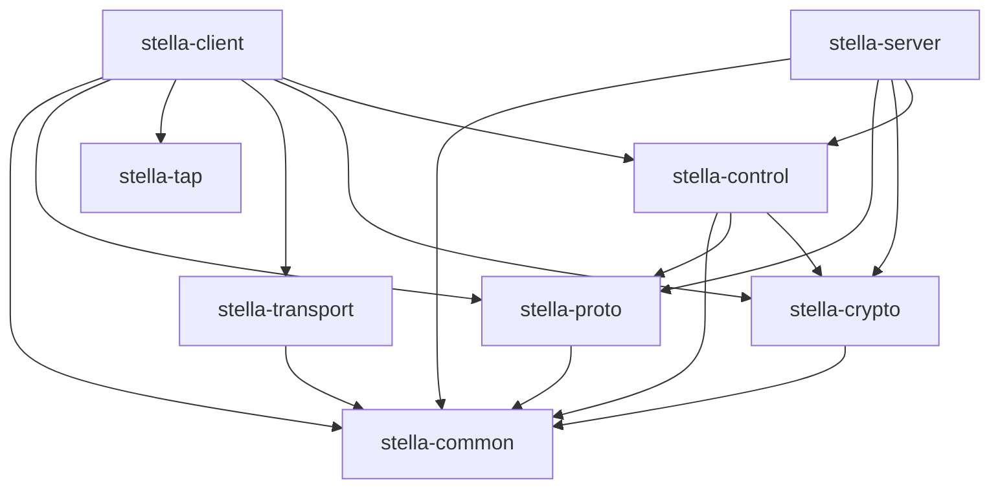

# Reference implementation architecture

This page describes the crate boundaries of the Stella reference
implementation. It is an implementation guide; normative interoperability
requirements live in `protocol/spec/`.

## Dependency direction

Lower-level crates must not depend on either binary. `stella-proto` remains
pure parsing and serialization logic with no sockets, operating-system handles,
configuration files, clocks, or random-number generation.

## Crate responsibilities

### `stella-common`

Owns small shared value types that do not encode a wire layout, including node
and virtual-network identifiers. It must stay lightweight and platform neutral.

### `stella-proto`

Owns protocol constants, message types, validation, and byte-level encoding.
It accepts all input as untrusted and must return typed errors rather than
panic. Cryptographic algorithms and I/O are injected by callers.

### `stella-tap`

Owns the safe TAP device contract and platform implementations. This is the
only crate permitted to contain unsafe code. Windows uses a native TAP-Windows
backend. macOS contains Stella's native feth/BPF/AF_NDRV implementation and the
bounded Unix-socket protocol used by `stella-tap-helper`. The ordinary client
uses a proxy `TapDevice`; only the helper creates interfaces and opens raw
packet descriptors. Unsupported platforms do not receive an implicit Layer-3
substitute.

### `stella-transport`

Owns the replaceable bounded-datagram abstraction and the initial UDP backend.
It preserves datagram boundaries and reports effective payload limits. It does
not decide membership, forwarding, or cryptographic trust.

### `stella-crypto`

Owns identity, key establishment, session keys, packet protection, replay
windows, and secret zeroization. It uses audited libraries selected by an ADR;
it never implements a cryptographic primitive itself.

### `stella-control`

Owns the bounded asynchronous record reader and writer, owned control-message
construction, per-connection sequencing and correlation, and canonical TLS
exporter proof transcripts shared by client and server. It delegates wire
validation to `stella-proto` and cryptographic operations to `stella-crypto`;
it owns no sockets, TLS trust policy, authority policy, or persistent state.

### `stella-server`

Owns controller configuration, persistent authority state, authenticated
control sessions, network membership, peer snapshots, and administrative CLI
commands. It must not become a mandatory unicast data relay.

### `stella-client`

Owns configuration and CLI behavior, controller sessions, virtual-switch state,
TAP lifecycle, transport sessions, forwarding, reconnect behavior, and graceful
shutdown.

## Runtime boundaries

The client uses one bounded path in each direction between TAP and the data
plane. Synchronous TAP operations run outside asynchronous executor workers.
Queues have explicit capacity and overflow policy; unbounded frame queues are
not allowed. Logging must not include secret keys, bearer credentials, or raw
user Ethernet payloads.

The controller treats every connection and message as untrusted until identity,
version, size, and authorization checks have succeeded. State distributed to
nodes carries an epoch and bounded lease so stale controller data eventually
expires.

## Testing layers

1. Unit tests cover value types, state machines, parsers, and error paths.
2. Property tests cover protocol round trips and malformed input.
3. Platform tests cover TAP lifecycle and actual frame I/O.
4. Integration tests run controller and clients over loopback transports.
5. Windows and macOS end-to-end tests use real TAP adapters or feth pairs and
   verify ARP, broadcast, multicast, LAN discovery, and bidirectional IP
   traffic.
