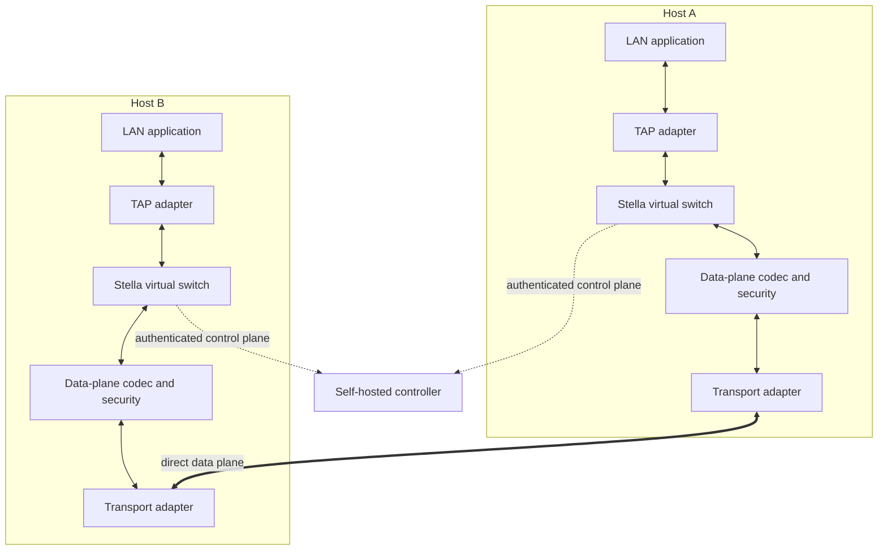

# Stella Protocol Overview

- Status: Draft
- Protocol version: 0.1
- Last updated: 2026-08-29

## 1. Purpose

Stella is an open Layer-2 virtual LAN protocol. It joins nodes reachable over
an IP transport into an Ethernet broadcast domain so that unmodified
applications can exchange unicast, broadcast, and multicast Ethernet frames.
Its primary use case is software, including older LAN games, that relies on
ARP, IPv4 broadcast, IPv6 multicast, NetBIOS, or another Ethernet-carried
discovery mechanism.

The protocol is designed for independent implementations and self-hosted
operation. A deployment has a centralized controller for policy and discovery,
while eligible peers exchange data frames directly.

## 2. Status and scope

Version 0.1 is the first design draft. This document establishes architecture,
terminology, trust boundaries, and invariants. Byte-level formats and state
machines are defined by the remaining specification documents.

The first implementation targets Windows with TAP-Windows. Linux and macOS
remain protocol requirements, but their device backends are implemented after
the Windows path is proven end to end.

Version 0.1 does not provide Internet reachability, NAT traversal, or an IP
routing service. The 0.2 connectivity extension adds controller-signaled
ICE/STUN discovery and relay fallback while preserving the transport and peer
security boundaries. A transport may still be plain UDP on a reachable network
or an existing overlay such as Tailscale.

## 3. Terminology

| Term | Definition |
| --- | --- |
| Controller | Self-hosted authority that authenticates nodes, evaluates network membership, and distributes peer state. |
| Node | One running Stella client with a cryptographic identity. |
| Virtual network | An isolated Ethernet broadcast domain identified by a stable network identifier. |
| Membership | Authorization for one node identity to participate in one virtual network. |
| Peer | Another authorized node in the same virtual network. |
| TAP device | Operating-system virtual Ethernet adapter used to exchange complete Ethernet frames with the host. |
| Control plane | Authenticated channel used for registration, membership, peer discovery, policy, and liveness. |
| Data plane | Peer-to-peer exchange of encapsulated Ethernet frames. |
| Transport | Replaceable datagram delivery mechanism beneath the Stella data plane. |
| Endpoint | Transport-specific address at which a node may receive data-plane packets. |
| Session | Time-bounded security context between two nodes or between a node and controller. |
| Epoch | Monotonic, controller-issued generation scoped to one virtual network and used to reject stale authorization. |
| Flood frame | A broadcast, multicast, or unknown-unicast frame delivered to more than one peer. |

Normative words **MUST**, **MUST NOT**, **SHOULD**, **SHOULD NOT**, and **MAY**
are interpreted as described by RFC 2119 and RFC 8174 when written in
uppercase.

## 4. Architectural invariants

1. The controller is authoritative for identity-to-network membership and
   policy.
2. The controller MUST NOT be required on the steady-state unicast data path
   after peers have current, usable endpoint information.
3. Nodes MUST NOT accept data-plane frames for a virtual network without a
   valid membership and session for that network.
4. Ethernet payload bytes MUST be preserved exactly between ingress and
   egress, except that frames rejected by explicit validation or policy are not
   forwarded.
5. The data-plane transport is replaceable and MUST NOT define Stella identity
   or membership semantics.
6. Failure of one virtual network MUST NOT disclose or inject frames into
   another virtual network.

## 5. Layered architecture

The client behaves as one port of a distributed virtual switch. Frames read
from the TAP adapter are classified by destination MAC address. Known unicast
traffic is sent to the selected peer. Broadcast, relevant multicast, and
unknown unicast traffic use the flood procedure defined by the broadcast
specification. Received data-plane packets are authenticated, associated with
the correct network and session, decoded, validated, and then written to TAP.

The controller performs no Ethernet learning on behalf of a healthy direct
path. It distributes authenticated membership and reachability information.
Relay is outside version 0.1 and is defined by the version 0.2 connectivity and
relay extensions without moving Ethernet learning into the controller.

## 6. Control plane and data plane

### 6.1 Control plane responsibilities

The control plane is responsible for:

- authenticating the controller to nodes and nodes to the controller;
- registering a node identity and its supported protocol versions;
- authorizing join and leave operations;
- distributing current peers, endpoints, capabilities, epochs, and policy;
- maintaining liveness with bounded leases and heartbeats;
- revoking membership and rotating security material;
- reporting errors without exposing secrets.

Version 0.1 uses TLS 1.3 over TCP with the explicit binary control encoding
defined by the control-plane specification. It provides mutual Stella identity
authentication, confidentiality, integrity, replay resistance, explicit
version negotiation, and bounded message sizes.

### 6.2 Data plane responsibilities

The data plane is responsible for:

- encapsulating a complete Ethernet frame with network and session context;
- authenticating every accepted packet;
- optionally encrypting Ethernet contents according to network policy;
- rejecting malformed, replayed, cross-network, or expired packets;
- supporting unicast and controlled flooding without changing Ethernet bytes;
- operating over a replaceable datagram transport.

## 7. Virtual network model

A virtual network is one isolated Ethernet broadcast domain. Each membership
binds a node identity, a virtual network identifier, permissions, and a lease.
A node may join more than one network, but state, learned MAC addresses,
security sessions, replay windows, and TAP attachment are scoped per network.

Version 0.1 assumes one TAP adapter per active network. Sharing one adapter
between networks would weaken isolation and is not specified.

The controller is the only authority allowed to create membership state. Peer
messages may improve reachability but MUST NOT grant membership.

## 8. Forwarding model

Each node maintains a soft-state forwarding database mapping source MAC
addresses to authenticated peer identities. A node learns a source MAC only
from a valid data-plane packet whose peer and network membership are current.
Entries expire and are removed immediately when the relevant membership is
revoked.

Ingress from TAP follows this conceptual order:

1. Validate the Ethernet frame length and local policy.
2. Classify the destination as local, known unicast, broadcast, multicast, or
   unknown unicast.
3. Select one peer for known unicast or the current eligible peer set for a
   flood frame.
4. Encapsulate and protect a separate Stella packet for each required peer.
5. Send through the configured transport.

Ingress from the transport follows this conceptual order:

1. Apply strict outer length and version checks.
2. Resolve network, peer, session, and replay state.
3. Authenticate and, when enabled, decrypt the packet.
4. Validate the inner Ethernet frame and update eligible forwarding state.
5. Write the unchanged Ethernet frame to the network TAP adapter.

Loops are prevented by never forwarding a transport-originated Ethernet frame
back to another transport peer in version 0.1. Only TAP-originated frames enter
the peer forwarding decision.

## 9. Comparison with related designs

| Property | Stella | VXLAN | ZeroTier VL1/VL2 concepts |
| --- | --- | --- | --- |
| Primary purpose | Self-hosted application-compatible virtual LAN | Data-center L2 overlay over L3 | General virtual networking overlay |
| Control model | Explicit centralized membership controller | External control plane or configured VTEPs | Distributed peer system with controller-assisted policy |
| Data path | Direct peer path after controller discovery | VTEP-to-VTEP, often underlay dependent | Direct peer path when reachable |
| Encapsulation | Independent versioned and authenticated Stella format | Standard UDP/VNI header | Project-specific packet and virtual-network layers |
| Security boundary | Protocol-level node identity and packet authentication, independent of underlay | Commonly delegated to the deployment network | Integrated identity and network authorization |
| Transport | Pluggable datagram abstraction | UDP/IP | Project-specific physical path abstraction |
| Broadcast handling | Authenticated bounded replication in 0.1 | Multicast or head-end replication | Managed virtual broadcast/multicast mechanisms |

Stella borrows only high-level architectural lessons: separating physical
reachability from virtual Ethernet semantics, learning forwarding state from
authenticated traffic, and keeping policy out of application payloads. Its
wire format, state machines, security construction, and implementation are
independent. No source code from the reference projects is used.

## 10. Threat model

### 10.1 Assets

- node private identity keys and active session keys;
- controller signing and service credentials;
- network membership, policy, and peer endpoint metadata;
- confidentiality and integrity of encapsulated Ethernet frames;
- availability of the controller, nodes, TAP adapters, and transports;
- isolation between virtual networks.

### 10.2 Adversaries in scope

Stella assumes an attacker may:

- observe, inject, modify, replay, delay, reorder, or drop transport packets;
- operate a malicious or compromised node that has membership in one network;
- learn public controller addresses and send arbitrary control messages;
- send malformed Ethernet frames through a locally controlled TAP interface;
- compromise the carrying network, including a nominally private underlay;
- attempt resource exhaustion using handshakes, floods, or malformed packets.

### 10.3 Required protections

- Control-plane traffic MUST be mutually authenticated, confidential, and
  integrity protected.
- Data-plane packets MUST always be authenticated. Encryption MAY be disabled
  only by explicit network policy; authentication is never disabled.
- Every protected packet MUST be bound to its protocol version, network,
  sending peer, session, direction, and sequence information.
- Receivers MUST enforce replay windows, bounded allocations, frame-size
  limits, rate limits, and membership expiry.
- A member of one network MUST NOT be able to authenticate traffic for another
  network.
- Revocation MUST take effect within a documented bounded interval and
  immediately after newer controller state is applied.

Using Tailscale or another encrypted underlay reduces exposure of endpoint and
packet metadata but does not remove any Stella security requirement. The
underlay is treated as an untrusted delivery service because it does not define
Stella membership, virtual-network isolation, or peer authorization.

### 10.4 Out of scope and residual risks

- A fully compromised controller can authorize malicious memberships and is a
  trusted deployment root.
- A compromised authorized node can observe broadcasts and inject Ethernet
  traffic allowed by its network policy.
- Traffic analysis, endpoint availability, host malware, and denial of service
  cannot be eliminated by the protocol.
- Version 0.1 does not promise anonymous membership, metadata privacy from the
  controller, Byzantine consensus, or post-quantum security.

## 11. Versioning principles

The version visible in data-plane packets is negotiated through the control
plane. A node MUST NOT send a version that the peer has not advertised. A
receiver MUST reject unsupported versions before interpreting version-specific
fields. Extensions are either length-delimited and explicitly skippable or
require a negotiated capability; silently changing an existing field is
forbidden.

Detailed compatibility and downgrade rules are defined in the versioning
specification.

## 12. Version 0.1 decision summary

The Phase 1 decisions are recorded in ADRs and detailed by the remaining
specification documents:

- TLS 1.3 over TCP carries explicitly framed binary control messages;
- all wire layouts use checked, documented big-endian fields and aligned TLVs;
- Ed25519, X25519, HKDF-SHA256, and ChaCha20-Poly1305 form the mandatory suite;
- data headers support authenticated fragmentation and keepalive packets;
- bounded sender-side replication handles broadcast, multicast, and unknown
  unicast;
- canonical network policy and signed grants bind limits and authorization.

Changes to these choices require a new ADR and compatibility analysis.
