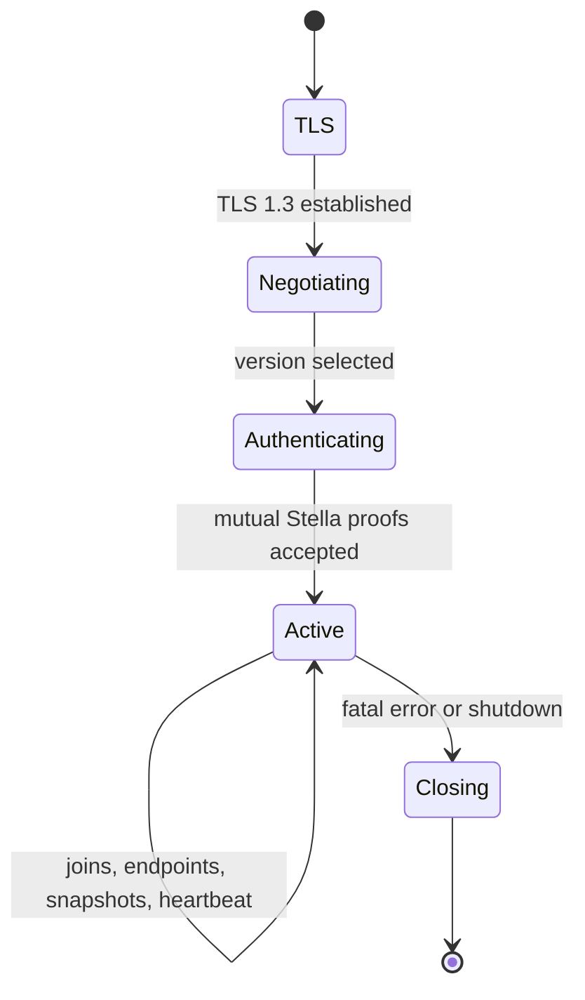

# Stella Control-Plane Protocol

- Status: Draft
- Protocol version: 0.1
- Last updated: 2026-08-29

## 1. Scope

This document defines Stella application messages carried inside the TLS 1.3
control connection. It covers framing, field encoding, mutual Stella identity
authentication, enrollment, network join and leave, endpoint publication, peer
state distribution, grant refresh, heartbeat, resynchronization, errors, and
reconnect behavior.

TLS requirements and signed proof inputs are defined in `08-security.md`.
Identity and grant formats are defined in `03-identity.md`.

## 2. Connection lifecycle

One TCP connection carries one node's control session:



The controller sends `SERVER_HELLO` immediately after TLS completes. Mutual
authentication MUST finish within ten seconds. Before `AUTH_RESULT` success,
neither side processes join, endpoint, peer, heartbeat, or grant messages.

A TLS connection authenticates one node ID. Sharing one connection between
node identities is forbidden.

## 3. Outer framing

Every application message has a four-byte unsigned big-endian `record_length`
followed by exactly that many message bytes. The length prefix is outside the
message and is protected by TLS like all other bytes.

`record_length` MUST be between 32 and 1,048,576 bytes. A receiver reads the
four-byte prefix into fixed storage, validates it, and only then allocates or
reserves bounded message storage. A zero length, oversized length, truncated
record, or connection close in the middle of a record is fatal to the control
connection.

TLS record boundaries have no Stella meaning. Implementations handle partial
and coalesced reads.

## 4. Control message header

Each framed message begins with this 32-byte header:

| Offset | Size | Field | Validation |
| ---: | ---: | --- | --- |
| 0 | 4 | `magic` | ASCII `STLC`, bytes `53 54 4c 43` |
| 4 | 1 | `version_major` | Selected major version |
| 5 | 1 | `version_minor` | Selected minor version |
| 6 | 2 | `message_type` | Registered control message type |
| 8 | 2 | `flags` | Type-specific; reserved bits zero |
| 10 | 2 | `header_length` | Header and header extensions in bytes |
| 12 | 4 | `body_length` | TLV body bytes |
| 16 | 8 | `message_id` | Sender-local non-zero monotonic ID |
| 24 | 8 | `correlation_id` | Request ID for a response, otherwise zero |

`header_length` is at least 32, at most 1,024, and a multiple of four. Header
extensions use the aligned extension format from `01-wire-format.md`; none are
registered in version 0.1.

The following equation MUST hold exactly:

```text
record_length == header_length + body_length
```

Each direction starts `message_id` at 1 and increments by one without gaps for
every transmitted control message. A receiver expects the next value exactly;
duplicate, zero, lower, skipped, or wrapped values are fatal. IDs restart on a
new TLS connection.

`correlation_id` is the triggering request's `message_id` for a direct response.
Unsolicited events and requests use zero. A response whose correlation is
unknown or already completed is a protocol error.

All version 0.1 control flags are zero.

## 5. Body TLV encoding

Message bodies contain ordered, four-byte-aligned TLVs:

| Offset within TLV | Size | Field | Meaning |
| ---: | ---: | --- | --- |
| 0 | 2 | `field_type` | Registered type; bit 15 marks critical |
| 2 | 2 | `field_length` | Value bytes, excluding prefix and padding |
| 4 | variable | `value` | Field value |
| after value | 0-3 | `padding` | Zero to four-byte alignment |

Field type zero is invalid. Fields MUST appear in strictly increasing numeric
type order. Duplicates are invalid unless a message definition explicitly
states otherwise; version 0.1 defines no repeated top-level field.

Unknown non-critical fields `0x0001` through `0x7fff` are skipped after bounds
and zero-padding validation. Unknown critical fields `0x8001` through `0xffff`
make the message unsupported. A required field omitted from a message is an
error even if other fields could imply a default.

Integer field values have exactly the registered width and use network byte
order. Text is strict UTF-8, contains no NUL or C0/C1 control character, and is
bounded by the field definition.

## 6. Field registry

All version 0.1 fields are critical:

| Type | Name | Value encoding |
| ---: | --- | --- |
| `0x8001` | `SUPPORTED_VERSIONS` | Version list |
| `0x8002` | `SELECTED_VERSION` | One version entry |
| `0x8003` | `SERVER_NONCE` | 32 bytes |
| `0x8004` | `CLIENT_NONCE` | 32 bytes |
| `0x8005` | `CONTROLLER_ID` | 16 bytes |
| `0x8006` | `CONTROLLER_PUBLIC_KEY` | 32 bytes |
| `0x8007` | `CONTROLLER_SIGNATURE` | 64 bytes |
| `0x8008` | `NODE_ID` | 16 bytes |
| `0x8009` | `NODE_PUBLIC_KEY` | 32 bytes |
| `0x800a` | `NODE_SIGNATURE` | 64 bytes |
| `0x800b` | `ENROLLMENT_TOKEN` | 32 raw decoded bytes |
| `0x800c` | `DISPLAY_NAME` | 1 through 64 UTF-8 bytes |
| `0x800d` | `STATUS_CODE` | Two-byte status |
| `0x800e` | `STATUS_MESSAGE` | 0 through 256 UTF-8 bytes |
| `0x800f` | `CONTROLLER_EPOCH` | Eight bytes, non-zero |
| `0x8010` | `NETWORK_ID` | 16 bytes, non-zero |
| `0x8011` | `JOIN_TOKEN` | 32 raw decoded bytes |
| `0x8012` | `MEMBERSHIP_GRANT` | 240 bytes |
| `0x8013` | `NETWORK_POLICY` | 64 bytes |
| `0x8014` | `SNAPSHOT_REVISION` | Eight bytes, non-zero |
| `0x8015` | `PEER_LIST` | Peer-list encoding |
| `0x8016` | `PEER_RECORD` | One peer-record encoding |
| `0x8017` | `DELTA_OPERATION` | One byte |
| `0x8018` | `ENDPOINT_SET` | Endpoint-set encoding |
| `0x8019` | `HEARTBEAT_COUNTER` | Eight bytes, non-zero |
| `0x801a` | `NETWORK_REVISIONS` | Network-revision list |
| `0x801b` | `SERVER_TIME` | Eight-byte Unix seconds |
| `0x801c` | `RETRY_AFTER_MS` | Four bytes, zero or 100 through 60,000 |
| `0x801d` | `SHUTDOWN_DEADLINE` | Eight-byte Unix seconds |

Tokens are permitted only in the messages that name them. A receiver MUST NOT
echo a token in status text or an error.

## 7. Nested encodings

### 7.1 Version list

`SUPPORTED_VERSIONS` is:

| Offset | Size | Field |
| ---: | ---: | --- |
| 0 | 1 | `count`, 1 through 32 |
| 1 | 3 | zero reserved bytes |
| 4 | `count * 4` | version entries |

Each entry is major `u8`, minor `u8`, suite ID `u16`. Entries are ordered from
most to least preferred and are unique. Version 0.1 advertises entry
`00 01 00 01`.

`SELECTED_VERSION` contains exactly one four-byte entry.

### 7.2 Endpoint record and set

Endpoint records are aligned and self-sized:

| Offset | Size | Field |
| ---: | ---: | --- |
| 0 | 1 | `kind`: 1 UDP/IPv4, 2 UDP/IPv6 |
| 1 | 1 | `priority`: 0 highest through 255 lowest |
| 2 | 2 | `record_length`: 16 for IPv4, 28 for IPv6 |
| 4 | 2 | UDP port, non-zero |
| 6 | 2 | zero reserved |
| 8 | 4 | maximum receivable datagram, 1,200 through 65,507 |
| 12 | 4 or 16 | address in network byte order |

Unspecified, multicast, and broadcast addresses are invalid. Loopback is
allowed only when both nodes are explicitly configured for a local test
network. IPv4-mapped IPv6 is encoded as IPv4.

An endpoint set begins with `count u8` from 0 through 8 and three zero bytes,
then exactly `count` records. Records are sorted by priority, kind, address, and
port. Exact duplicates are invalid.

### 7.3 Peer record and list

A peer record begins:

| Offset | Size | Field |
| ---: | ---: | --- |
| 0 | 2 | `record_length`, total bytes including endpoints |
| 2 | 1 | `endpoint_count`, 0 through 8 |
| 3 | 1 | zero reserved |
| 4 | 16 | node ID |
| 20 | 32 | Ed25519 public key |
| 52 | 240 | membership grant |
| 292 | variable | endpoint records |

`record_length` is at least 292, at most 516, and a multiple of four. The grant,
node ID, public key, network, controller, and epoch MUST be mutually consistent.
Endpoint records use the ordering above.

A peer list begins with `count u16`, two zero bytes, then `count` peer records.
Count is at most `max_flood_peers - 1`. Records are strictly sorted by node ID
and do not contain the receiving node.

### 7.4 Network-revision list

This value begins with `count u16` and two zero bytes. Each 32-byte entry is:

- network ID: 16 bytes;
- controller epoch: 8 bytes;
- last snapshot revision: 8 bytes.

Entries are strictly sorted by network ID and contain no zero value.

### 7.5 Canonical network policy

`NETWORK_POLICY` is exactly 64 bytes:

| Offset | Size | Field | Validation |
| ---: | ---: | --- | --- |
| 0 | 4 | `magic` | ASCII `SNP1` |
| 4 | 1 | `format_version` | `1` |
| 5 | 1 | `confidentiality` | 0 authenticate-only, 1 encrypt |
| 6 | 2 | `total_length` | `64` |
| 8 | 2 | `max_frame_size` | 1,514 through 9,216 |
| 10 | 2 | `max_flood_peers` | 2 through 256 |
| 12 | 4 | `flood_rate` | 1 through 1,000,000 frames/s |
| 16 | 4 | `flood_burst` | `flood_rate` through 2,000,000 |
| 20 | 4 | `mac_age_seconds` | 30 through 3,600 |
| 24 | 2 | `heartbeat_seconds` | 5 through 300 |
| 26 | 2 | `peer_lease_seconds` | At least three heartbeat intervals, at most 900 |
| 28 | 4 | `session_lifetime_seconds` | 60 through 3,600 |
| 32 | 4 | `reassembly_timeout_ms` | 500 through 10,000 |
| 36 | 4 | `reserved` | Zero |
| 40 | 16 | `network_id` | Matching network |
| 56 | 8 | `policy_revision` | Non-zero monotonic revision |

The membership-grant `policy_digest` is SHA-256 over these exact 64 bytes.
Changing any policy byte requires a new controller epoch and new grants.

## 8. Message registry and required fields

Fields in each row are listed in required numeric order. Parentheses mark an
optional field.

| Type | Name | Direction | Required body fields |
| ---: | --- | --- | --- |
| `0x0001` | `SERVER_HELLO` | S to C | versions, server nonce, controller ID, controller public key, server time |
| `0x0002` | `CLIENT_HELLO` | C to S | selected version, client nonce, node ID, node public key |
| `0x0003` | `SERVER_PROOF` | S to C | controller signature |
| `0x0004` | `NODE_AUTH` | C to S | node signature, (enrollment token), (display name) |
| `0x0005` | `AUTH_RESULT` | S to C | status code, (status message), controller epoch, server time |
| `0x0010` | `JOIN_REQUEST` | C to S | network ID, (join token) |
| `0x0011` | `JOIN_RESULT` | S to C | status code, (status message), controller epoch, network ID, (grant), (policy), (revision) |
| `0x0012` | `LEAVE_REQUEST` | C to S | network ID |
| `0x0013` | `LEAVE_RESULT` | S to C | status code, (status message), controller epoch, network ID |
| `0x0020` | `ENDPOINT_UPDATE` | C to S | network ID, endpoint set |
| `0x0021` | `ENDPOINT_RESULT` | S to C | status code, (status message), controller epoch, network ID, snapshot revision |
| `0x0030` | `PEER_SNAPSHOT` | S to C | controller epoch, network ID, grant, policy, snapshot revision, peer list |
| `0x0031` | `PEER_DELTA` | S to C | (node ID), controller epoch, network ID, snapshot revision, (peer record), delta operation |
| `0x0032` | `SNAPSHOT_REQUEST` | C to S | network ID, snapshot revision |
| `0x0040` | `HEARTBEAT` | C to S | heartbeat counter, network revisions |
| `0x0041` | `HEARTBEAT_ACK` | S to C | heartbeat counter, network revisions, server time |
| `0x0050` | `GRANT_REFRESH` | S to C | controller epoch, network ID, grant, policy, snapshot revision |
| `0x00fe` | `SERVER_SHUTDOWN` | S to C | status message, shutdown deadline |
| `0x00ff` | `ERROR` | Both | status code, (status message), (retry after) |

`S to C` means controller to client. Messages in the wrong direction are fatal
protocol errors.

## 9. Authentication exchange

### 9.1 `SERVER_HELLO`

The first application message is `SERVER_HELLO` with message ID 1 and
correlation zero. It advertises all supported `(major, minor, suite)` entries,
a fresh server nonce, controller identity, and current server time.

### 9.2 `CLIENT_HELLO`

The client selects exactly one advertised entry that it supports. It sends a
fresh client nonce and its existing or newly generated node identity. The
correlation ID references `SERVER_HELLO`.

For `CLIENT_HELLO` only, header version bytes contain the selected version. All
later messages on the connection use the same bytes.

### 9.3 Proof messages

`SERVER_PROOF` contains the signature defined by the security specification and
correlates to `CLIENT_HELLO`. The client verifies it before sending
`NODE_AUTH`.

`NODE_AUTH` contains the node proof. A node unknown to the controller also
supplies one enrollment token. A known node MUST NOT send an enrollment token
unless the controller's administrative policy explicitly requests
re-enrollment after a rejected authentication.

`AUTH_RESULT` correlates to `NODE_AUTH`. On success, status is zero and the
controller epoch is the highest current epoch for this authority. On failure,
the controller sends a generic status and closes TLS after a small randomized
delay. It does not distinguish unknown key, bad token, disabled node, or bad
signature to an unauthenticated peer.

## 10. Join and leave

An authenticated client sends one `JOIN_REQUEST` for each configured network.
A join token is required when the node does not already have an administrative
membership assignment. Join tokens use the same generation, storage, secrecy,
expiry, and atomic-consumption rules as enrollment tokens but are domain-hashed
with `stella join token v1`.

Successful `JOIN_RESULT` status zero includes the node's signed membership
grant, canonical policy, and current snapshot revision. The client validates
all objects before activating the network. The controller then sends a complete
`PEER_SNAPSHOT`, even when the peer list is empty.

A successful leave increments the controller epoch, removes authorization,
responds with `LEAVE_RESULT`, and distributes updated state. The leaving client
stops TAP forwarding before it sends the request. An interrupted leave is
reconciled from authoritative state on reconnect.

Join and leave requests are idempotent for the same authenticated node and
network. Repeating a successful join returns current state; repeating an absent
leave returns success without another epoch change.

## 11. Endpoint publication

After a successful join, the client sends `ENDPOINT_UPDATE` with the endpoints
on which it is ready to receive peer datagrams. An empty set withdraws all
direct endpoints without leaving the network.

The controller validates syntax and administrative address policy, stores the
set, increments the network snapshot revision, and returns `ENDPOINT_RESULT`.
Endpoint changes do not change the controller epoch because they do not grant
authorization.

The controller never treats an endpoint as proof of identity. A node accepts a
datagram from any source address only when its Stella handshake and membership
validate; after validation it MAY update observed reachability according to the
discovery specification.

## 12. Peer snapshots and deltas

Snapshot revision is a per-network non-zero monotonic `u64`. It increments for
any peer membership, grant, public metadata, or endpoint change visible to
members. It never wraps.

`PEER_SNAPSHOT` replaces the entire local view atomically. A client validates
every record and all limits into temporary bounded state before swapping it
into service. One invalid record rejects the complete snapshot and triggers an
error plus `SNAPSHOT_REQUEST` for the last accepted revision.

`PEER_DELTA` applies only when its revision is exactly one greater than the
last accepted revision. `DELTA_OPERATION` values are:

| Value | Operation | Additional field |
| ---: | --- | --- |
| 1 | Add or replace peer | `PEER_RECORD` |
| 2 | Remove peer | `NODE_ID` |

A gap, duplicate with different content, lower revision, missing target, or
policy inconsistency causes no partial update and triggers `SNAPSHOT_REQUEST`.
The controller answers with a full snapshot, not a chain of guessed deltas.

A higher authenticated controller epoch invalidates all lower-epoch local
state before the new snapshot is activated. A removal immediately erases the
peer's sessions, forwarding entries, and reassembly buffers.

## 13. Grant refresh

The controller sends `GRANT_REFRESH` before the local membership grant expires.
It includes current policy and revision so the client can validate their digest
and epoch together. Refresh with the same epoch changes only time validity or a
grant serial; policy or authorization changes require a higher epoch.

The client keeps the old grant until the new one validates, then swaps
atomically. It begins peer rekey when a grant serial changes. If no valid grant
remains, it disables forwarding for that network even if TLS is still open.

## 14. Heartbeat and leases

An active client sends `HEARTBEAT` at the smallest `heartbeat_seconds` among its
joined networks, or every 30 seconds when it has none. Counter starts at 1 and
increments without wrap. The message reports each active network's accepted
epoch and revision.

The controller responds with `HEARTBEAT_ACK` using the same counter and its
authoritative network revision list. A mismatch prompts a snapshot or epoch
update. Heartbeat responses also provide server time for clock diagnostics but
never cause the client to set the operating-system clock.

If no valid heartbeat is received within a network's `peer_lease_seconds`, the
controller marks the node unavailable, withdraws endpoints, and updates peer
snapshots. It does not revoke membership solely for transient liveness loss.

The client reconnects after three missed acknowledgements or a TCP/TLS failure.
Existing peer data sessions may continue only while their grants, epoch, and
session lifetime remain valid.

## 15. Error and shutdown behavior

Status zero means success. Registered non-zero status classes are:

| Range | Meaning |
| --- | --- |
| 1-99 | malformed or unsupported request |
| 100-199 | authentication or authorization denied |
| 200-299 | network or membership state conflict |
| 300-399 | resource or rate limit |
| 400-499 | transient controller failure |
| 500-599 | client state or revision error |

A direct request failure uses its normal result message when possible. `ERROR`
is used for a connection-level problem or a message type without a result. A
fatal error is sent only when the peer is authenticated and framing remains
trustworthy, then TLS is closed.

`SERVER_SHUTDOWN` gives authenticated clients an advisory deadline. Clients
begin reconnect backoff but continue valid peer sessions until their normal
authorization bounds. The message is not proof that another endpoint is safe.

## 16. Reconnect and backoff

After unexpected disconnect, the client retries after one second with full
jitter, doubling the ceiling on each failure to a maximum of 30 seconds. A
successful authenticated connection resets the backoff.

Every new connection performs complete TLS, exporter-bound proofs, and message
ID initialization. The client reports its current network revisions through
heartbeat only after authentication; the controller then sends any required
fresh snapshots. Control messages from an old TLS connection are never applied
to a new one.

## 17. Resource limits

The reference implementation enforces at least these bounds per connection:

- one in-progress framed read;
- 1 MiB maximum record;
- 256 outstanding correlated requests;
- 256 joined networks, with deployments expected to configure fewer;
- eight endpoints per network;
- 256 total members per version 0.1 network;
- 64 KiB maximum aggregate buffered outbound control data;
- ten-second authentication and request timeout;
- bounded status and display strings as registered above.

When an outbound queue is full, the controller coalesces replaceable peer state
into a new full snapshot or closes a persistently slow connection. It does not
allow unbounded deltas or heartbeat messages to accumulate.

## 18. Decoder failure requirements

Control input MUST NOT panic, overrun a slice, wrap an integer, allocate without
a checked bound, or leave partially applied state. Decoders distinguish at
least framing, header, version, type, flags, message ID, correlation, TLV,
UTF-8, nested-record, semantic, authentication, authorization, revision, and
resource-limit errors.

Malformed input before authentication is closed without a detailed protocol
response. After authentication, a redacted error may identify the invalid field
type or state transition but MUST NOT echo tokens, signatures, keys, grants, or
arbitrary attacker-provided text.
