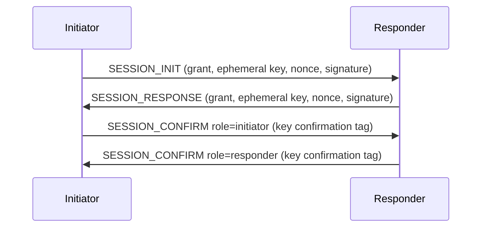

# Stella Security Protocol

- Status: Draft
- Protocol version: 0.1
- Last updated: 2026-08-29

## 1. Scope and mandatory suite

This document defines control-channel binding, peer data-session establishment,
key derivation, confirmation, replay defense, rekeying, downgrade prevention,
and security failure behavior.

Version 0.1 has exactly one interoperable cryptographic suite:

| Suite ID | Name |
| ---: | --- |
| `0x0001` | `ED25519_X25519_HKDF_SHA256_CHACHA20_POLY1305` |

The suite consists of Ed25519, X25519, SHA-256, HKDF-SHA256, and
ChaCha20-Poly1305 with a 128-bit tag. Implementations MUST use audited library
implementations and operating-system randomness. There is no null suite and no
algorithm fallback.

## 2. Security domains

Stella separates these security contexts:

- TLS 1.3 protects the controller connection;
- Ed25519 authenticates Stella identities and signed controller objects;
- ephemeral X25519 and HKDF establish one peer data session;
- independent ChaCha20-Poly1305 keys protect each data direction;
- membership grants authorize identity use in a network and epoch.

A credential valid in one context MUST NOT be accepted in another. Every hash,
signature, and HKDF expansion uses the exact domain string specified here or in
the identity specification.

## 3. Control-channel security

### 3.1 TLS requirements

The control connection uses TLS 1.3 over TCP. A client MUST:

- validate the server certificate chain and configured DNS name, or validate
  the explicitly configured SHA-256 SPKI pin;
- reject expired, not-yet-valid, name-mismatched, revoked when known, or
  otherwise invalid certificates;
- reject TLS versions below 1.3;
- disable early data and never send Stella messages as TLS 0-RTT data;
- reject a plaintext response, redirect, or protocol downgrade.

The controller MUST use a certificate suitable for server authentication and
MUST NOT request protocol behavior that bypasses client validation. Certificate
rotation with pinning requires a configuration containing both old and new
pins during an administrator-controlled overlap.

### 3.2 TLS exporter binding

After the TLS handshake, both sides derive 32 bytes with the TLS exporter:

```text
label   = UTF8("EXPORTER-Stella-Control-v1")
context = empty
length  = 32
```

The resulting `control_exporter` is never transmitted. It binds Stella
authentication to this exact TLS connection and prevents a signed
authentication exchange from being replayed through another connection.

### 3.3 Controller proof

The controller sends a fresh 32-byte `server_nonce`, its Stella Ed25519 public
key, controller ID, and supported Stella versions. After version selection it
signs:

```text
UTF8("stella controller proof v1") ||
control_exporter ||
server_nonce ||
selected_version_major ||
selected_version_minor ||
selected_suite_be[2] ||
controller_id ||
controller_public_key
```

The client verifies the ID derivation, configured controller ID, and Ed25519
signature before sending an enrollment token or node proof.

### 3.4 Node proof

The client generates a fresh 32-byte `client_nonce` and signs:

```text
UTF8("stella node proof v1") ||
control_exporter ||
server_nonce ||
client_nonce ||
selected_version_major ||
selected_version_minor ||
selected_suite_be[2] ||
controller_id ||
node_id ||
node_public_key
```

The controller recomputes the node ID and verifies the signature. It then
evaluates enrollment or existing-node status. A proof authenticates the key but
does not itself authorize a network join.

Nonces MUST come from the operating-system random generator. A side rejects an
all-zero nonce and MUST NOT intentionally reuse a nonce. The TLS exporter makes
accidental nonce reuse across connections non-equivalent, but implementations
still generate fresh values.

## 4. Peer session overview

Peers receive each other's identity public keys, membership grants, transport
endpoints, and current epoch through the authenticated control plane. They then
run a three-stage datagram exchange:



The preferred initiator is the node with the lexicographically smaller node ID.
The other node may initiate after the discovery fallback delay when no valid
exchange is in progress. A node responds to any valid initiation, but the
smaller-ID initiation wins when simultaneous handshakes are detected.

The exchange provides mutual long-term authentication, ephemeral key agreement,
membership and policy binding, forward secrecy, key confirmation, and replay
resistance. Endpoint addresses are delivery hints, not identity.

## 5. Handshake datagram header

`SESSION_INIT`, `SESSION_RESPONSE`, `SESSION_CONFIRM`, and `SESSION_REJECT` use
a 96-byte fixed header. Its first 32 bytes are the common datagram header from
the wire-format specification.

| Offset | Size | Field | Validation |
| ---: | ---: | --- | --- |
| 0 | 32 | `common` | Packet type matches the message |
| 32 | 16 | `sender_node_id` | Claimed sender |
| 48 | 16 | `receiver_node_id` | Intended receiver |
| 64 | 8 | `controller_epoch` | Non-zero authorized epoch |
| 72 | 8 | `handshake_id` | Non-zero random exchange identifier |
| 80 | 8 | `timestamp` | Unix time in seconds |
| 88 | 8 | `session_id` | Non-zero random proposed session identifier |

`header_length` MUST be at least 96 and a multiple of four. Version 0.1 defines
no handshake extensions. Unknown non-critical extensions follow the generic
skip rule but are included in every signature and hash exactly as received.

Handshake `flags` are zero except for `SESSION_CONFIRM`, where bit `0x01` is
defined below. All other flag bits are zero. Handshake messages have no separate
AEAD trailer; their signature or confirmation tag is included in
`payload_length`.

`timestamp` MUST be within 120 seconds of the receiver's wall clock. A node with
an unreliable clock refuses new handshakes. Timestamp acceptance is only a
coarse replay bound and does not replace handshake-ID caches or grant expiry.

## 6. `SESSION_INIT`

The `SESSION_INIT` payload is exactly 392 bytes:

| Payload offset | Size | Field | Validation |
| ---: | ---: | --- | --- |
| 0 | 240 | `initiator_grant` | Valid grant matching sender, network, and epoch |
| 240 | 16 | `receiver_grant_serial` | Serial of the expected receiver grant |
| 256 | 32 | `initiator_ephemeral` | X25519 public key |
| 288 | 32 | `initiator_nonce` | Fresh random bytes, not all zero |
| 320 | 4 | `max_datagram_size` | Initiator receive limit, 1,200 through 65,507 |
| 324 | 4 | `reserved` | Zero |
| 328 | 64 | `signature` | Initiator Ed25519 signature |

The signature input is:

```text
UTF8("stella session init v1") ||
datagram[0..header_length] ||
payload[0..328]
```

The receiver verifies, in order, structural bounds, rate limits, known network,
receiver ID, expected controller epoch, grant structure and controller
signature, timestamp, receiver grant serial, node ID derivation, and initiator
signature. It performs X25519 only after those checks.

The presented grant MUST match the cached peer authorization in every field
except `not_before` and `not_after`, and it MUST be valid at the receiver's
current time. The controller may sign equivalent grants for different refresh
windows, so implementations MUST verify the presented controller signature and
MUST NOT require byte-for-byte equality with a grant received in another
snapshot. The grant serial, identity, epoch, permissions, limits, and policy
digest still match exactly.

The receiver rejects an all-zero or low-order X25519 shared secret according to
the X25519 library's contributory-behavior check.

## 7. `SESSION_RESPONSE`

For an accepted initiation the responder generates a fresh ephemeral X25519 key
pair and 32-byte nonce. The `SESSION_RESPONSE` payload is exactly 408 bytes:

| Payload offset | Size | Field | Validation |
| ---: | ---: | --- | --- |
| 0 | 240 | `responder_grant` | Valid grant matching sender, network, and epoch |
| 240 | 32 | `init_hash` | SHA-256 of the exact complete `SESSION_INIT` datagram |
| 272 | 32 | `responder_ephemeral` | X25519 public key |
| 304 | 32 | `responder_nonce` | Fresh random bytes, not all zero |
| 336 | 4 | `max_datagram_size` | Responder receive limit, 1,200 through 65,507 |
| 340 | 4 | `reserved` | Zero |
| 344 | 64 | `signature` | Responder Ed25519 signature |

The response repeats the initiation's network ID, controller epoch, handshake
ID, and session ID. Sender and receiver IDs are reversed. The signature input
is:

```text
UTF8("stella session response v1") ||
datagram[0..header_length] ||
payload[0..344]
```

The initiator performs the symmetric grant, identity, policy, timestamp, hash,
and signature checks. The two grants MUST agree on controller ID, network ID,
epoch, confidentiality policy, policy digest, frame limit, and flood-peer
limit. Each grant must contain the permission required for its direction.
The responder grant uses the same semantic-match rule for independently issued
validity windows described for `SESSION_INIT`.

## 8. Transcript and key schedule

After validating both signed messages, each side calculates:

```text
init_hash = SHA-256(complete_SESSION_INIT_datagram)
response_hash = SHA-256(complete_SESSION_RESPONSE_datagram)

transcript_hash = SHA-256(
    UTF8("stella session transcript v1") ||
    complete_SESSION_INIT_datagram ||
    complete_SESSION_RESPONSE_datagram
)

shared_secret = X25519(local_ephemeral_private, remote_ephemeral_public)
prk = HKDF-Extract(salt = transcript_hash, IKM = shared_secret)
```

The complete datagrams include headers, extension padding, payloads, and
signatures. Their own length fields make the concatenation unambiguous.

HKDF-Expand uses the following exact UTF-8 `info` values:

| Output | Length | `info` |
| --- | ---: | --- |
| Initiator-to-responder data key | 32 | `stella data i2r key v1` |
| Responder-to-initiator data key | 32 | `stella data r2i key v1` |
| Initiator-to-responder nonce prefix | 4 | `stella data i2r nonce v1` |
| Responder-to-initiator nonce prefix | 4 | `stella data r2i nonce v1` |
| Initiator confirmation key | 32 | `stella confirm initiator v1` |
| Responder confirmation key | 32 | `stella confirm responder v1` |

Each expansion is a separate HKDF operation from the same `prk`. No output is
used as another output's input. The X25519 private keys, raw shared secret, and
HKDF PRK are erased from mutable memory after expansion as far as the language
and platform permit.

The effective per-direction Stella fragment limit uses the smaller of the local
transport send limit and the remote `max_datagram_size`, minus the actual data
header and tag. If no positive fragment of a 14-byte frame can be carried, the
handshake fails.

## 9. `SESSION_CONFIRM`

`SESSION_CONFIRM` proves that both sides derived the same transcript and keys.
Its payload is exactly 56 bytes:

| Payload offset | Size | Field | Validation |
| ---: | ---: | --- | --- |
| 0 | 32 | `response_hash` | SHA-256 of the exact response datagram |
| 32 | 1 | `role` | `1` initiator, `2` responder |
| 33 | 7 | `reserved` | Zero |
| 40 | 16 | `confirmation_tag` | ChaCha20-Poly1305 tag for empty plaintext |

The initiator sends `role = 1` with header flag bit `0x01` clear. The responder
sends `role = 2` with header flag bit `0x01` set. Any mismatch between flag and
role is invalid.

Confirmation uses the role's 32-byte confirmation key and an all-zero 12-byte
nonce. The key is unique to this transcript and is used for exactly one logical
confirmation value; retransmissions repeat identical bytes. AEAD plaintext is
empty and associated data is:

```text
UTF8("stella session confirm v1") ||
transcript_hash ||
datagram[0..header_length] ||
payload[0..40]
```

The responder begins accepting initiator `DATA` only after validating the
initiator confirmation. It then sends the responder confirmation. The
initiator declares the session established only after validating that response.
The responder may declare it established after sending its confirmation.

If the responder confirmation is lost, the initiator retransmits its identical
confirmation and the responder repeats its identical response. Confirmation
keys are erased when the handshake cache expires.

## 10. `SESSION_REJECT`

A responder silently discards structurally invalid, unauthenticated, unknown,
or rate-limited initiation attempts. It sends `SESSION_REJECT` only after the
initiator grant and signature have been authenticated.

The payload is exactly 104 bytes:

| Payload offset | Size | Field | Validation |
| ---: | ---: | --- | --- |
| 0 | 2 | `reason` | Registered rejection reason |
| 2 | 2 | `reserved` | Zero |
| 4 | 4 | `retry_after_ms` | Zero or 100 through 60,000 |
| 8 | 32 | `init_hash` | SHA-256 of rejected initiation |
| 40 | 64 | `signature` | Responder long-term Ed25519 signature |

Signature input:

```text
UTF8("stella session reject v1") ||
datagram[0..header_length] ||
payload[0..40]
```

Registered reasons are:

| Value | Name |
| ---: | --- |
| 1 | `STALE_EPOCH` |
| 2 | `GRANT_EXPIRED` |
| 3 | `POLICY_MISMATCH` |
| 4 | `SESSION_COLLISION` |
| 5 | `TEMPORARILY_BUSY` |
| 6 | `PATH_MTU_TOO_SMALL` |

Rejection is diagnostic and does not authorize state. Unknown reasons are
reported generically.

## 11. Retransmission and replay

An initiator sends the first `SESSION_INIT`, waits 250 ms, and retransmits the
identical datagram with exponential backoff capped at two seconds. It abandons
the attempt after ten seconds. It never changes a timestamp, nonce, ephemeral
key, signature, handshake ID, or session ID during retransmission.

A responder caches an authenticated initiation and its exact response for five
minutes. An identical initiation yields the identical cached response. Reuse of
the same `(sender, network, epoch, handshake_id)` with different bytes is a
replay conflict and is silently dropped.

Reference resource limits are 32 incomplete handshakes per remote node and 256
total. Implementations apply endpoint and node token buckets before expensive
signature or X25519 operations. Eviction erases ephemeral private material.

Handshake IDs and session IDs are random non-zero 64-bit values. A session ID
must be unused for the same network and peer pair. Collision produces an
authenticated rejection and a completely new initiation with new random and
ephemeral values.

## 12. Session lifecycle and rekey

Once established, both directional protected-packet sequence numbers and frame
IDs start at 1. Data fragments and keepalives share the protected-packet
sequence space. A session stops sending and begins a replacement handshake
before the first of:

- one hour since establishment;
- 2^32 sent protected packets in either direction;
- controller epoch or membership-grant change;
- local endpoint or transport capability change requiring a new path contract;
- administrator-requested rekey.

The deterministic smaller-node-ID peer initiates routine rekey. A new session
uses new ephemeral keys, nonces, handshake ID, and session ID. After the new
session is confirmed, the old session becomes receive-only for at most 30
seconds to absorb reordered packets, then its keys and replay state are erased.
No new frames are transmitted with the old key.

A revoked, expired, or lower-epoch session has no grace period. It is removed
immediately with its MAC entries and reassembly state.

## 13. Data packet security

Data headers, fragmentation, nonce construction, AEAD coverage, and replay
windows are defined in the wire-format specification. Security invariants are:

- a directional nonce never repeats under one key;
- every accepted header byte and fragment byte is authenticated;
- decryption or authentication completes before replay commitment, reassembly,
  learning, TAP delivery, or payload logging;
- keys are scoped to one peer pair, network, controller epoch, session, and
  direction through the signed transcript and HKDF salt;
- authenticate-only mode never disables integrity or replay protection.

An implementation MUST NOT retry tag verification with another key, epoch,
nonce interpretation, or algorithm after the selected session fails. Such
fallback would create downgrade and oracle behavior.

## 14. Downgrade prevention

The TLS exporter proofs include the selected protocol version and suite. Peer
signatures include complete headers containing the protocol version; version
0.1 has one mandatory suite, and future multi-suite handshakes require an
explicit signed suite field. Membership grants include a policy digest and
confidentiality policy. Therefore any change to version, suite, or encryption
policy invalidates a proof, signature, transcript, or tag.

A node advertises the versions and suite IDs it actually implements, selects
only their intersection, and rejects a controller or peer that selects an
unadvertised value. Version 0.1 has one suite, so omission of suite `0x0001`
means no compatible secure session.

Network policy decides between encrypt and authenticate-only. A client MUST NOT
locally weaken `Encrypt` to authenticate-only. An administrator who changes the
policy causes a controller epoch change and new membership grants and peer
sessions.

## 15. Secret handling

Private identity keys, TLS private keys, ephemeral X25519 private keys, shared
secrets, HKDF intermediate values, data keys, confirmation keys, enrollment
tokens, and unexpired bearer credentials are secret.

Secret types:

- redact `Debug` and display output;
- are not cloned unless required by a documented ownership boundary;
- are held for the shortest practical lifetime;
- are zeroized from mutable buffers on normal drop where supported;
- never appear in tracing fields, panic text, metrics labels, or packet captures
  generated by Stella itself.

Public keys, node IDs, network IDs, controller IDs, epochs, and grant serials
are not secret but may be deployment-sensitive metadata.

## 16. Failure behavior

Authentication, signature, grant, replay, and decryption failures are terminal
for the affected message. They never cause plaintext fallback. Repeated failure
causes rate limiting and eventually a control-plane peer refresh, not automatic
trust of a new identity.

The client stops forwarding for a network when it has no valid local grant or
trusted current controller state. It closes the TAP forwarding path before
discarding authorization state so host applications cannot inject frames into
an unauthenticated session during teardown.

Unexpected cryptographic library failure is treated as a local fatal error for
the affected process or network instance. The implementation reports a redacted
cause and does not continue with partially initialized key state.

## 17. Required security tests

An implementation test suite includes:

- published Ed25519, X25519, HKDF-SHA256, and ChaCha20-Poly1305 primitive vectors
  through the selected libraries;
- Stella transcript and key-schedule vectors with fixed keys and nonces;
- controller and node TLS-exporter proof verification;
- membership-grant signature, expiry, epoch, and policy failures;
- bit mutation of every signed and authenticated field;
- replay-window boundaries and failed-tag non-advancement;
- handshake retransmission, collision, simultaneous initiation, and timeout;
- all-zero shared-secret rejection;
- encryption-policy downgrade attempts;
- secret redaction and zeroization behavior where observable.

The Stella repository publishes deterministic protocol vectors alongside the
codec implementation. A vector includes every input byte, intermediate digest,
derived key, nonce prefix, output packet, and expected validation result.
